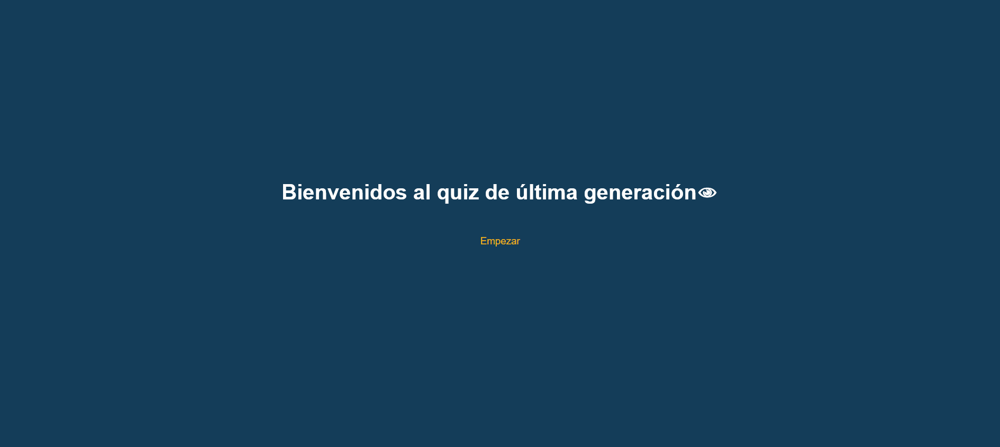
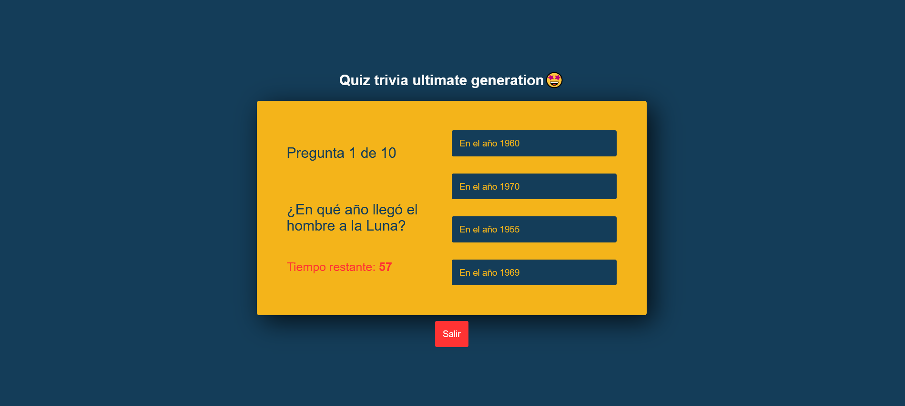
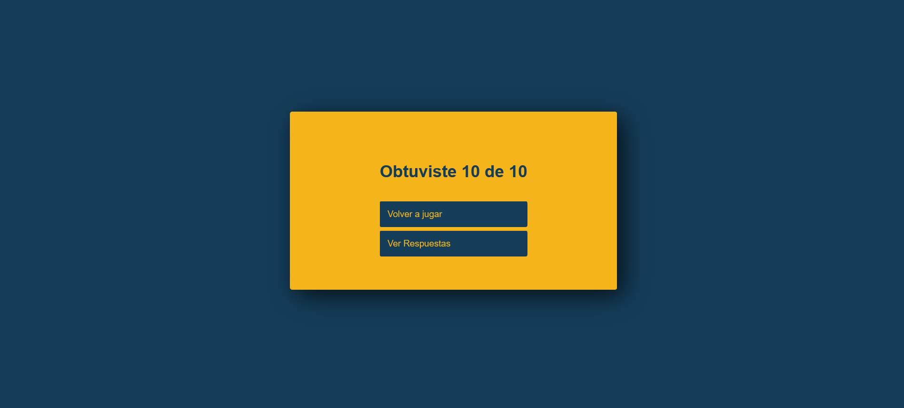

# quizapp
Un simple quiz trivia tipo examen.

Se utilizó Reactjs, JS y CSS.

## Imagenes y Livepreview
->> [Live preview](https://chrisvd9.github.io/simple-blackjack-game/) <<-

Imagen 1:

Imagen 2:

Imagen 3:

